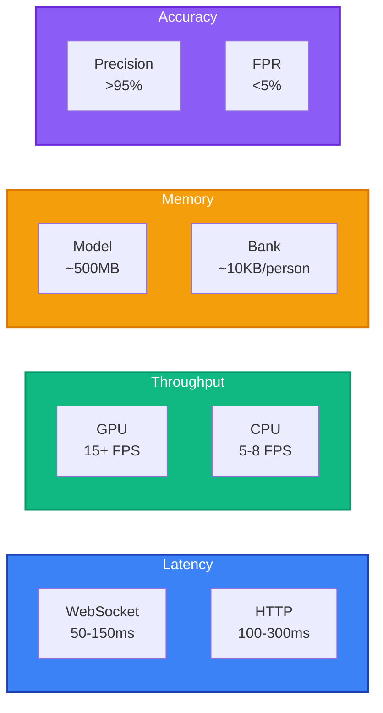

# EyeSis 프로젝트 기획서

<div align="center">

**실시간 얼굴 식별·추적 시스템 아키텍처 및 기술 설계 문서**


</div>

---

## 목차

1. [프로젝트 개요](#1-프로젝트-개요)
2. [시스템 아키텍처](#2-시스템-아키텍처)
3. [기술 스택 및 Trade-off](#3-기술-스택-및-trade-off)
4. [핵심 알고리즘](#4-핵심-알고리즘)
5. [데이터 플로우](#5-데이터-플로우)
6. [모듈 설계](#6-모듈-설계)
7. [성능 최적화](#7-성능-최적화)
8. [보안 및 확장성](#8-보안-및-확장성)

---

## 1. 프로젝트 개요

### 1.1 핵심 목표

| 목표 | 설명 | KPI |
|------|------|-----|
| **정확한 인식** | InsightFace 기반 SOTA 얼굴 인식 | 정확도 >95% |
| **실시간 처리** | WebSocket 기반 저지연 스트리밍 | 지연시간 <150ms |
| **오탐 최소화** | 다층 필터링 시스템 | 오탐률 <5% |
| **확장 가능** | 모듈화된 아키텍처 | 인물 수 무제한 |

### 1.2 핵심 가치 제안

```mermaid
mindmap
  root((EyeSis<br/>Value Proposition))
    Accuracy
      >95% 정확도
      Multi-Bank 시스템
    Real-time
      50-150ms 지연
      WebSocket 기반
    Security
      <5% 오탐률
      다층 필터링
    Auto-Learning
      자동 임베딩 수집
      동적 Bank 관리
    Analytics
      타임라인 시각화
      CSV 내보내기
    Extensible
      모듈화 아키텍처
      ES Modules 기반
```



---

## 2. 시스템 아키텍처

### 2.1 전체 시스템 구조

```mermaid
graph TB
    subgraph Client["Client Layer"]
        subgraph Frontend["Web Frontend"]
            Handlers["handlers"]
            Timeline["timeline"]
            Persons["persons"]
            Detection["detection"]
            Clips["clips"]
            Snapshots["snapshots"]
            Log["log"]
            Enroll["enroll"]
            Core["Core:<br/>config | state | ui | utils"]
        end
    end
    
    subgraph API["API Layer"]
        FastAPI["FastAPI Server"]
        Endpoints["API Endpoints<br/>/ws/detect<br/>/api/detect<br/>/api/persons<br/>/api/enroll<br/>/api/logs"]
    end
    
    subgraph Service["Service Layer"]
        FaceDetection["FaceDetection<br/>InsightFace<br/>buffalo_l"]
        BankManager["BankManager<br/>Base Bank<br/>Dynamic Bank<br/>Masked Bank"]
        TemporalFilter["TemporalFilter<br/>연속성 체크"]
    end
    
    subgraph Data["Data Layer"]
        PostgreSQL["PostgreSQL<br/>persons<br/>detection_logs<br/>embeddings"]
        FileStorage["File Storage<br/>bank_base.npy<br/>bank_dynamic.npy<br/>centroid_base.npy"]
    end
    
    Frontend -->|WebSocket/HTTP| FastAPI
    FastAPI --> Endpoints
    Endpoints --> FaceDetection
    Endpoints --> BankManager
    Endpoints --> TemporalFilter
    FaceDetection --> PostgreSQL
    BankManager --> FileStorage
    BankManager --> PostgreSQL
    
    style Client fill:#10B981,stroke:#059669,stroke-width:2px,color:#fff
    style API fill:#3B82F6,stroke:#1E40AF,stroke-width:2px,color:#fff
    style Service fill:#F59E0B,stroke:#D97706,stroke-width:2px,color:#fff
    style Data fill:#8B5CF6,stroke:#6D28D9,stroke-width:2px,color:#fff
```



### 2.2 프론트엔드 모듈 아키텍처

```mermaid
graph TD
    Entry["script.js<br/>Entry Point<br/>~2,100 lines"]
    
    subgraph CoreModules["Core Modules"]
        Config["config.js<br/>API URL, WebSocket URL"]
        State["state.js<br/>전역 상태 관리"]
        UI["ui.js<br/>DOM 요소 참조"]
        Utils["utils.js<br/>유틸리티 함수"]
    end
    
    subgraph FeatureModules["Feature Modules"]
        API["api.js<br/>API 호출"]
        Handlers["handlers.js<br/>이벤트 핸들러<br/>(15+ 함수)"]
        Timeline["timeline.js<br/>타임라인 렌더링"]
        Persons["persons.js<br/>인물 카드 관리"]
        Clips["clips.js<br/>클립 기능"]
        Snapshots["snapshots.js<br/>스냅샷 기능"]
        Log["log.js<br/>감지 로그"]
        Detection["detection.js<br/>박스 렌더링"]
        Enroll["enroll.js<br/>등록 폼"]
    end
    
    Entry -->|imports| CoreModules
    Entry -->|imports| FeatureModules
    CoreModules --> FeatureModules
    
    style Entry fill:#4F46E5,stroke:#312E81,stroke-width:3px,color:#fff
    style CoreModules fill:#10B981,stroke:#059669,stroke-width:2px,color:#fff
    style FeatureModules fill:#3B82F6,stroke:#1E40AF,stroke-width:2px,color:#fff
```



### 2.3 데이터 흐름


---

## 3. 기술 스택 및 Trade-off

### 3.1 핵심 기술 선택

| 분야 | 선택 | 대안 | 선택 이유 |
|------|------|------|----------|
| **Face Model** | InsightFace buffalo_l | ArcFace, FaceNet | SOTA 성능, ONNX 지원 |
| **Detection** | RetinaFace | MTCNN, YOLOv5-face | InsightFace 통합, 높은 정확도 |
| **Backend** | FastAPI | Flask, Django | 비동기 처리, WebSocket 네이티브 |
| **Database** | PostgreSQL | MySQL, MongoDB | 복잡 쿼리, JSONB 지원 |
| **Frontend** | Vanilla JS + ES Modules | React, Vue | 경량화, 빠른 로딩 |

### 3.2 Trade-off 분석

#### 3.2.1 정확도 vs 속도

```mermaid
graph LR
    subgraph Accuracy["정확도 우선"]
        A1["모든 프레임 처리"]
        A2["큰 Detection Size"]
        A3["Bank 전체 비교"]
        A4["모든 필터링 활성화"]
    end
    
    subgraph Balanced["현재 설정 (균형) ★"]
        B1["선택적 프레임 스킵"]
        B2["(640, 640) Size"]
        B3["Bank 우선 사용"]
        B4["모든 필터링 활성화"]
    end
    
    subgraph Speed["속도 우선"]
        S1["프레임 스킵"]
        S2["작은 Size"]
        S3["Centroid만"]
        S4["최소 필터링"]
    end
    
    Accuracy -.->|Trade-off| Balanced
    Balanced -.->|Trade-off| Speed
    
    style Balanced fill:#10B981,stroke:#059669,stroke-width:3px,color:#fff
    style Accuracy fill:#3B82F6,stroke:#1E40AF,stroke-width:2px,color:#fff
    style Speed fill:#F59E0B,stroke:#D97706,stroke-width:2px,color:#fff
```



#### 3.2.2 임베딩 저장 방식

| 방식 | 정확도 | 속도 | 메모리 | 사용 시점 |
|------|--------|------|--------|----------|
| **Bank** | ⭐⭐⭐⭐⭐ | ⭐⭐⭐ | ⭐⭐ | 기본 |
| **Centroid** | ⭐⭐⭐ | ⭐⭐⭐⭐⭐ | ⭐⭐⭐⭐⭐ | Fallback |

---

## 4. 핵심 알고리즘

### 4.1 Multi-Bank 임베딩 시스템

```mermaid
graph TD
    Query["Query Embedding<br/>(512-d)"]
    
    BaseBank["Base Bank<br/>(N × 512)<br/>초기 등록<br/>정면 사진<br/>고품질 임베딩"]
    DynamicBank["Dynamic Bank<br/>(M × 512)<br/>자동 수집<br/>영상 분석 시<br/>다양한 각도/조명"]
    MaskedBank["Masked Bank<br/>(K × 512)<br/>마스크 착용 얼굴<br/>낮은 임계값 적용"]
    
    Match["Best Match<br/>= max(sim(query, all_banks))"]
    
    Query --> BaseBank
    Query --> DynamicBank
    Query --> MaskedBank
    
    BaseBank --> Match
    DynamicBank --> Match
    MaskedBank --> Match
    
    style Query fill:#4F46E5,stroke:#312E81,stroke-width:3px,color:#fff
    style BaseBank fill:#10B981,stroke:#059669,stroke-width:2px,color:#fff
    style DynamicBank fill:#3B82F6,stroke:#1E40AF,stroke-width:2px,color:#fff
    style MaskedBank fill:#F59E0B,stroke:#D97706,stroke-width:2px,color:#fff
    style Match fill:#8B5CF6,stroke:#6D28D9,stroke-width:3px,color:#fff
```



### 4.2 다층 오탐 방지 시스템

```mermaid
flowchart TD
    Input["Input Detection"]
    
    L1["L1: sim_gap 체크<br/>1위-2위 유사도 차이 ≥5%"]
    L2["L2: bbox 필터링<br/>동일 영역 다중 매칭 제거"]
    L3["L3: 연속성 체크<br/>최근 5프레임 내 동일 인물"]
    L4["L4: 화질 임계값<br/>동적 임계값 조정"]
    
    Final["Final Match ✓"]
    Reject["Reject"]
    
    Input --> L1
    L1 -->|Pass| L2
    L1 -->|Fail| Reject
    L2 -->|Pass| L3
    L2 -->|Fail| Reject
    L3 -->|Pass| L4
    L3 -->|Fail| Reject
    L4 -->|Pass| Final
    L4 -->|Fail| Reject
    
    style Input fill:#3B82F6,stroke:#1E40AF,stroke-width:2px,color:#fff
    style L1 fill:#10B981,stroke:#059669,stroke-width:2px,color:#fff
    style L2 fill:#10B981,stroke:#059669,stroke-width:2px,color:#fff
    style L3 fill:#10B981,stroke:#059669,stroke-width:2px,color:#fff
    style L4 fill:#10B981,stroke:#059669,stroke-width:2px,color:#fff
    style Final fill:#4F46E5,stroke:#312E81,stroke-width:3px,color:#fff
    style Reject fill:#EF4444,stroke:#DC2626,stroke-width:2px,color:#fff
```



### 4.3 적응형 임계값 계산

```python
def calculate_threshold(quality, mask_prob):
    base = 0.45
    
    # 화질 조정
    quality_adj = {
        'high': +0.04,
        'medium': 0,
        'low': -0.03
    }[quality]
    
    # 마스크 조정
    mask_adj = -0.05 * mask_prob
    
    # 최종 임계값 (0.28 ~ 0.50 범위)
    return clamp(base + quality_adj + mask_adj, 0.28, 0.50)
```

---

## 5. 데이터 플로우

### 5.1 인물 등록 플로우

```mermaid
flowchart TD
    Input["이미지 입력"]
    
    Detect["얼굴 감지<br/>RetinaFace<br/>(bboxes)"]
    Extract["임베딩 추출<br/>buffalo_l<br/>(512-d)<br/>L2 정규화"]
    Create["Bank 생성<br/>bank_base.npy (N × 512)<br/>centroid_base.npy (512)"]
    Save["DB 저장 + File 저장<br/>PostgreSQL + .npy"]
    
    Input --> Detect
    Detect --> Extract
    Extract --> Create
    Create --> Save
    
    style Input fill:#3B82F6,stroke:#1E40AF,stroke-width:2px,color:#fff
    style Detect fill:#10B981,stroke:#059669,stroke-width:2px,color:#fff
    style Extract fill:#F59E0B,stroke:#D97706,stroke-width:2px,color:#fff
    style Create fill:#8B5CF6,stroke:#6D28D9,stroke-width:2px,color:#fff
    style Save fill:#4F46E5,stroke:#312E81,stroke-width:3px,color:#fff
```



### 5.2 실시간 감지 플로우

```mermaid
flowchart TD
    Input["프레임 입력"]
    
    Skip{"프레임 스킵?<br/>이전 처리 중이면 스킵"}
    Detect["얼굴 감지<br/>RetinaFace"]
    
    Process["각 얼굴 처리<br/>• 임베딩 추출<br/>• 각도 추정<br/>• 화질 추정<br/>• Bank 매칭<br/>• 마스크 추정<br/>• 임계값 계산"]
    
    Filter["오탐 방지 필터링<br/>L1-L4 다층 필터"]
    
    Classify["결과 분류<br/>• 매칭 확정<br/>• 검토 대상<br/>• 미매칭"]
    
    Send["클라이언트 전송"]
    
    Input --> Skip
    Skip -->|No| Detect
    Skip -->|Yes| Send
    Detect --> Process
    Process --> Filter
    Filter --> Classify
    Classify --> Send
    
    style Input fill:#3B82F6,stroke:#1E40AF,stroke-width:2px,color:#fff
    style Skip fill:#F59E0B,stroke:#D97706,stroke-width:2px,color:#fff
    style Detect fill:#10B981,stroke:#059669,stroke-width:2px,color:#fff
    style Process fill:#8B5CF6,stroke:#6D28D9,stroke-width:2px,color:#fff
    style Filter fill:#EF4444,stroke:#DC2626,stroke-width:2px,color:#fff
    style Classify fill:#4F46E5,stroke:#312E81,stroke-width:2px,color:#fff
    style Send fill:#10B981,stroke:#059669,stroke-width:3px,color:#fff
```



---

## 6. 모듈 설계

### 6.1 프론트엔드 모듈 책임

| 모듈 | 책임 | 주요 함수 |
|------|------|----------|
| `config.js` | 설정 관리 | `API_BASE_URL`, `WS_URL` |
| `state.js` | 상태 관리 | `state` 객체 |
| `ui.js` | DOM 참조 | `initUI()` |
| `utils.js` | 유틸리티 | `formatTime()`, `getCategoryStyle()` |
| `api.js` | API 호출 | `loadPersons()`, `checkServerHealth()` |
| `handlers.js` | 이벤트 처리 | 15+ 핸들러 함수 |
| `timeline.js` | 타임라인 | `renderTimelineWithMerging()` |
| `persons.js` | 인물 관리 | `createSuspectCard()` |
| `clips.js` | 클립 기능 | `downloadVideoClip()` |
| `snapshots.js` | 스냅샷 | `renderSnapshotCard()` |
| `log.js` | 로그 관리 | `addDetectionLogItem()` |
| `detection.js` | 박스 렌더링 | `drawDetections()` |
| `enroll.js` | 등록 폼 | `checkFormValidity()` |

### 6.2 백엔드 서비스 책임

| 서비스 | 책임 | 주요 메서드 |
|--------|------|------------|
| `FaceDetection` | 얼굴 감지/인식 | `detect()`, `match()` |
| `BankManager` | Bank CRUD | `add_embedding()`, `get_best_match()` |
| `TemporalFilter` | 시간적 일관성 | `check_continuity()` |
| `DataLoader` | 데이터 로딩 | `load_gallery()` |

---

## 7. 성능 최적화

### 7.1 최적화 전략

| 영역 | 전략 | 효과 |
|------|------|------|
| **네트워크** | WebSocket 지속 연결 | 핸드셰이크 오버헤드 제거 |
| **프레임** | 동적 스킵 | 서버 부하 분산 |
| **렌더링** | Canvas 캐싱 | 불필요한 렌더링 방지 |
| **모델** | ONNX Runtime | 최적화된 추론 |
| **메모리** | Bank 크기 제한 | 메모리 사용량 관리 |

### 7.2 성능 지표



---

## 8. 보안 및 확장성

### 8.1 보안 고려사항

| 영역 | 구현 | 상태 |
|------|------|------|
| **CORS** | 화이트리스트 방식 | 🔄 개발: 전체 허용 |
| **인증** | JWT 토큰 | 📋 계획 |
| **데이터 암호화** | HTTPS + WSS | ✅ 지원 |
| **입력 검증** | Pydantic 스키마 | ✅ 적용 |

### 8.2 확장성 로드맵

```mermaid
gantt
    title 확장성 로드맵
    dateFormat YYYY-MM
    section Phase 1 완료
    단일 서버           :done, phase1-1, 2024-01, 2024-06
    단일 DB             :done, phase1-2, 2024-01, 2024-06
    ES Modules          :done, phase1-3, 2024-07, 2024-09
    section Phase 2 진행 중
    Anti-Spoofing       :active, phase2-1, 2024-10, 2025-03
    다중 카메라         :active, phase2-2, 2024-12, 2025-05
    section Phase 3 계획
    분산 처리           :phase3-1, 2025-06, 2025-12
    클라우드 배포       :phase3-2, 2025-06, 2025-12
    모바일 앱           :phase3-3, 2025-09, 2026-03
```



---

## 9. 결론

EyeSis는 **정확도, 실시간성, 확장성**을 균형있게 달성한 얼굴 인식 시스템입니다.

### 핵심 성과

| 지표 | 목표 | 달성 |
|------|------|------|
| 정확도 | >95% | ✅ |
| 오탐률 | <5% | ✅ |
| 지연시간 | <200ms | ✅ 50-150ms |
| 코드 모듈화 | - | ✅ 13개 모듈 |

### 주요 Trade-off 결정

1. **정확도 vs 속도**: Bank 방식으로 정확도 우선
2. **복잡도 vs 정확도**: 다층 필터링으로 정확도 향상
3. **메모리 vs 정확도**: Dynamic Bank로 자동 학습

---

<div align="center">

**Last Updated: 2024.12**

</div>
