# EyeSis 서비스 개선 이력

<div align="center">

**실시간 얼굴 감지 서비스 기술 진화 문서**


</div>

---

## 목차

1. [개요](#개요)
2. [서비스 진화 타임라인](#서비스-진화-타임라인)
3. [상세 개선 내역](#상세-개선-내역)
4. [성능 비교](#성능-비교)
5. [현재 아키텍처](#현재-아키텍처)
6. [향후 로드맵](#향후-로드맵)

---

## 개요

EyeSis는 초기 서버사이드 렌더링 방식에서 시작하여 여러 단계의 최적화를 거쳐 현재의 **WebSocket 기반 실시간 감지 시스템**으로 발전했습니다.

### 핵심 개선 지표

| 지표 | 초기 | 현재 | 개선율 |
|------|------|------|--------|
| 지연 시간 | 200-500ms | 50-150ms | **70% 감소** |
| 네트워크 사용량 | ~500KB/프레임 | ~2KB/프레임 | **99% 감소** |
| 프레임 끊김 | 심함 | 없음 | **완전 해결** |
| 박스 안정성 | 불안정 | 안정적 | **완전 해결** |

---

## 서비스 진화 타임라인


---

## 상세 개선 내역

### Phase 1: 서버사이드 렌더링 (초기)

**구현 방식**
- 클라이언트에서 비디오 프레임 캡처 → Base64 인코딩
- HTTP POST로 서버 전송
- 서버에서 박스가 그려진 이미지를 Base64로 반환
- 클라이언트에서 반환된 이미지 표시

**문제점**
- ❌ 심각한 프레임 끊김
- ❌ 높은 네트워크 대역폭 (~500KB/프레임)
- ❌ 서버 부하 증가 (렌더링 작업)
- ❌ 긴 지연 시간 (200-500ms)

---

### Phase 2: 클라이언트사이드 렌더링

**구현 방식**
- 서버는 좌표(bbox) + 메타데이터만 JSON으로 반환
- 클라이언트에서 Canvas API로 박스 렌더링

**개선 사항**
- ✅ 네트워크 대역폭 99% 감소
- ✅ 서버 부하 감소

**잔여 문제**
- ⚠️ HTTP 요청-응답 사이클 지연
- ⚠️ 박스 튀는 현상 (비동기 처리 문제)
- ⚠️ 동기화 문제

---

### Phase 3: WebSocket 기반 실시간 통신

**구현 방식**
```javascript
// WebSocket 연결 및 프레임 전송
function connectWebSocket() { ... }
function sendWebSocketFrame(frameData, suspectIds) { ... }
function handleWebSocketMessage(message) { ... }

// HTTP 폴백
async function detectFrameToServerHTTP(frameData) { ... }
```

**개선 사항**
- ✅ 프레임 끊김 완전 해결
- ✅ 박스 튀는 현상 해결 (프레임 ID 추적)
- ✅ 자동 재연결 (지수 백오프)
- ✅ HTTP 폴백 메커니즘

---

### Phase 4: Multi-Bank 임베딩 시스템

**구현 방식**
```
outputs/embeddings/<person_id>/
├── bank_base.npy      # 정면 사진 (N×512)
├── bank_dynamic.npy   # 자동 수집 (M×512)
├── bank_masked.npy    # 마스크 착용 (K×512)
└── centroid_base.npy  # 평균 임베딩 (512)
```

**개선 사항**
- ✅ 다양한 각도 인식 지원
- ✅ 자동 학습 (감지 시 임베딩 수집)
- ✅ 중복 방지 (유사도 0.95 이상 스킵)

---

### Phase 5: 얼굴 각도 감지

**구현 방식**
```python
def estimate_face_angle(face) -> Tuple[str, float]:
    # 랜드마크 기반 yaw 각도 계산
    return angle_type, yaw_angle

# 각도 분류
# front:         -15° ~ 15°
# left/right:    15° ~ 45°
# profile:       45° ~ 90°
```

**개선 사항**
- ✅ 정면/측면/프로필 인식
- ✅ 각도 정보 UI 표시
- ✅ 각도별 Bank 저장

---

### Phase 6: 박스 렌더링 최적화

**개선 사항**

1. **스타일 개선**
   - 선 두께: 3px → 4px
   - 모서리 강조선 추가
   - 반투명 배경 (80% 투명도)

2. **색상 체계**
   - 🔴 빨간색: 범죄자
   - 🟢 초록색: 일반인
   - 🟡 노란색: 미확인

3. **동적 위치 조정**
   - 화면 경계 체크
   - 스마트 배치 (위/아래 자동)

4. **좌표 변환 정확도**
   - `object-contain` CSS 정확 반영
   - 비디오/캔버스 크기 동기화

---

### Phase 7: ES Modules 프론트엔드 리팩토링 (최신)

**변경 전**
```
web/
├── script.js          # 4,152줄 (모놀리식)
└── snapshot_functions.js
```

**변경 후**
```
web/
├── script.js          # 2,111줄 (49% 감소!)
└── modules/           # 13개 모듈
    ├── config.js      # 설정/URL
    ├── state.js       # 전역 상태
    ├── ui.js          # DOM 요소
    ├── utils.js       # 유틸리티
    ├── api.js         # API 호출
    ├── handlers.js    # 이벤트 핸들러 ⭐ 신규
    ├── timeline.js    # 타임라인
    ├── persons.js     # 인물 관리
    ├── clips.js       # 클립 기능
    ├── snapshots.js   # 스냅샷
    ├── log.js         # 감지 로그
    ├── detection.js   # 박스 렌더링
    └── enroll.js      # 등록 폼
```

**개선 사항**
- ✅ 코드량 49% 감소 (4,152줄 → 2,111줄)
- ✅ 단일 책임 원칙 적용
- ✅ 모듈별 독립적 테스트 가능
- ✅ 유지보수성 대폭 향상

**핸들러 모듈 (`handlers.js`)**
```javascript
// 분리된 이벤트 핸들러 (15+ 함수)
export function handleViewSnapshots() { ... }
export function handleCloseClipModal() { ... }
export function handleOpenAddSuspectModal() { ... }
export function handleEscapeKey(e) { ... }
// ...
```

---

## 성능 비교

### 전체 비교표

| 단계 | 네트워크 | 지연 시간 | 프레임 끊김 | 코드량 |
|------|----------|----------|------------|--------|
| Phase 1 | ~500KB | 200-500ms | 심함 | - |
| Phase 2 | ~2KB | 100-300ms | 보통 | - |
| Phase 3 | ~2KB | 50-150ms | 없음 | ~4,000줄 |
| Phase 7 | ~2KB | 50-150ms | 없음 | **~2,100줄** |

### 코드 구조 개선

```mermaid
graph LR
    subgraph Before["Before (Phase 1-6)"]
        Script1["script.js<br/>4,152 lines<br/>모놀리식 구조<br/>• 함수 혼재<br/>• 상태 분산<br/>• 테스트 어려움"]
    end
    
    subgraph After["After (Phase 7)"]
        Script2["script.js<br/>Entry Point<br/>~2,111 lines<br/>(49% 감소)"]
        Modules["13 Modules<br/>• config.js<br/>• state.js<br/>• handlers.js<br/>• ...11 more"]
        Script2 --> Modules
    end
    
    Before -->|리팩토링| After
    
    style Before fill:#EF4444,stroke:#DC2626,stroke-width:2px,color:#fff
    style After fill:#10B981,stroke:#059669,stroke-width:2px,color:#fff
    style Script1 fill:#FCA5A5,stroke:#DC2626,stroke-width:2px,color:#000
    style Script2 fill:#86EFAC,stroke:#059669,stroke-width:2px,color:#000
    style Modules fill:#86EFAC,stroke:#059669,stroke-width:2px,color:#000
```



---

## 현재 아키텍처


---

## 향후 로드맵

### Short-term (Q1 2025)

| 기능 | 우선순위 | 상태 |
|------|----------|------|
| Face Anti-Spoofing | High | 🔄 진행 중 |
| 다중 카메라 지원 | Medium | 📋 계획 |
| 실시간 FPS 모니터링 | Low | 📋 계획 |

### Mid-term (Q2-Q3 2025)

| 기능 | 설명 |
|------|------|
| 분산 처리 | 멀티 GPU 지원 |
| 클라우드 배포 | AWS/GCP 지원 |
| 모바일 앱 | iOS/Android 지원 |

### Long-term (2026+)

- Edge Device 배포 (Raspberry Pi, Jetson)
- 행동 인식 (Action Recognition)
- 군중 밀도 분석

---

## 참고 자료

### 코드 위치

| 기능 | 파일 |
|------|------|
| WebSocket 통신 | `web/script.js` |
| 이벤트 핸들러 | `web/modules/handlers.js` |
| 박스 렌더링 | `web/modules/detection.js` |
| 타임라인 | `web/modules/timeline.js` |
| 백엔드 API | `backend/api/detection.py` |
| Bank 관리 | `backend/services/bank_manager.py` |

---

<div align="center">

**Last Updated: 2024.12**

*EyeSis - Real-time Face Recognition System*

</div>
