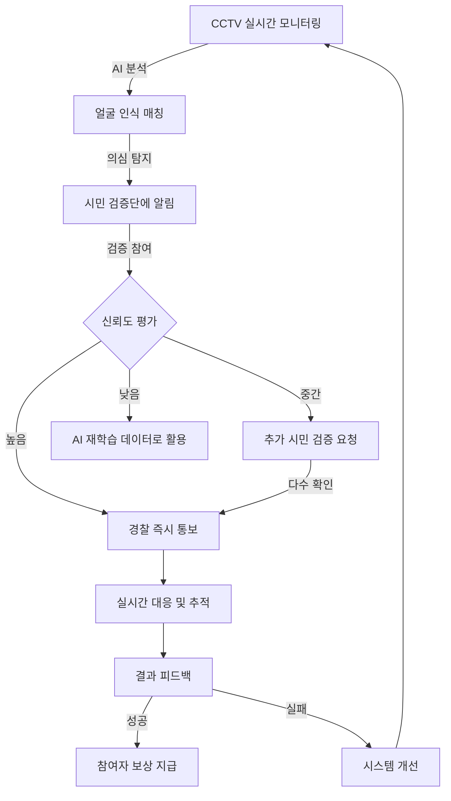
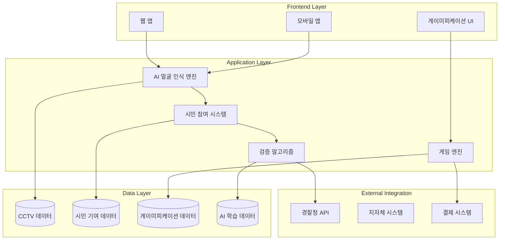
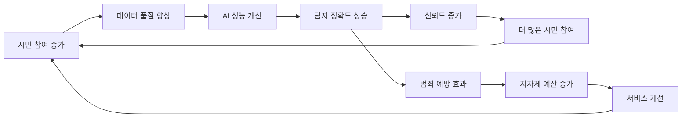

# FaceWatch 서비스 발전 방향
## Citizen AI Collaboration + Novelty Verification 통합 비전

> 동네의 안전을 지키기 위해 범죄자 및 실종자를 CCTV로 찾되,  
> 시민의 협력을 통해 아이디어가 발전되고,  
> 게이미피케이션을 통해 콘텐츠가 다채로워지는 혁신적 커뮤니티 안전 플랫폼

---

## 🎯 핵심 비전

**FaceWatch**는 단순한 얼굴 인식 시스템을 넘어, **시민과 AI가 협력하는 지능형 커뮤니티 안전 생태계**로 진화합니다.

### 3대 핵심 축

1. **AI-Powered Safety**: 고성능 얼굴 인식으로 범죄자/실종자 실시간 탐지
2. **Citizen Collaboration**: 시민의 적극적 참여와 집단 지성 활용
3. **Gamified Engagement**: 게이미피케이션으로 지속 가능한 참여 생태계 구축

---

## 🧩 1. Citizen AI Collaboration (시민 AI 협력)

### 1.1 시민 참여 구조

#### 🔍 **목격 정보 제공**
- **AI 매칭 결과 검증**: AI가 탐지한 결과를 시민이 확인하고 평가
- **추가 정보 제공**: 목격 시간, 장소, 상황 등 상세 정보 입력
- **사진/영상 업로드**: 시민이 직접 촬영한 목격 자료 제출

#### 💡 **아이디어 제안 시스템**
- **새로운 탐지 영역 제안**: 특정 구역의 CCTV 모니터링 요청
- **시스템 개선 아이디어**: AI 알고리즘, UI/UX 개선 제안
- **커뮤니티 투표**: 제안된 아이디어를 커뮤니티가 투표로 선택

#### 🤝 **협력 네트워크**
- **시민 검증단**: 신뢰도 높은 사용자가 AI 결과를 1차 검증
- **전문가 협력**: 경찰, 보안 전문가와의 실시간 협업 채널
- **지역 커뮤니티**: 동네별 안전 네트워크 구축

### 1.2 AI + 시민 협력 워크플로우

### 1.3 시민 참여 인센티브

#### 🏆 **보상 시스템**
- **포인트 적립**: 검증, 목격 정보 제공 시 포인트 적립
- **실물 보상**: 포인트를 지역 상점 할인권, 기프티콘으로 교환
- **공공 기여 인증**: 지방자치단체 발급 봉사 시간 인정서

#### 🎖️ **명예 시스템**
- **등급 시스템**: 브론즈 → 실버 → 골드 → 플래티넘 → 다이아몬드
- **배지 획득**: 특별 업적 달성 시 희귀 배지 수여
- **리더보드**: 지역별, 전국 기여도 순위표

---

## 🔬 2. Novelty Verification (신규성 검증)

### 2.1 아이디어 발굴 시스템

#### 💎 **시민 제안 수집**
- **개선 아이디어 공모**: 매월 테마별 아이디어 챌린지 개최
  - 예: "마스크 착용자 인식 개선", "야간 저화질 영상 처리"
- **자유 제안 게시판**: 언제든지 아이디어 제출 가능
- **문제 신고**: 시스템 오작동, 오탐지 사례 보고

#### 🧪 **검증 프로세스**
1. **초기 필터링**: AI가 중복/비현실적 아이디어 자동 제거
2. **커뮤니티 투표**: 1차 투표로 상위 10개 아이디어 선정
3. **전문가 평가**: 기술 팀이 실현 가능성 평가
4. **파일럿 테스트**: 선정된 아이디어를 실제 시스템에 적용
5. **성과 측정**: A/B 테스트로 효과 검증

### 2.2 혁신 발굴 영역

#### 🎯 **AI 성능 개선**
- **새로운 탐지 기법**: 걸음걸이, 복장, 동반자 패턴 인식
- **환경 적응**: 날씨, 시간대별 최적화 알고리즘
- **프라이버시 강화**: 익명화 기술, 데이터 최소 수집

#### 🗺️ **서비스 확장**
- **실종 반려동물 찾기**: 얼굴 인식 기술의 동물 적용
- **지역 이벤트 모니터링**: 축제, 집회 등 인파 관리
- **취약 계층 보호**: 치매 노인, 아동 실종 예방

#### 🌐 **커뮤니티 기능**
- **안전 지도**: 실시간 위험 지역 표시
- **알림 시스템**: 내 주변 의심 인물 탐지 시 즉시 알림
- **교육 콘텐츠**: 범죄 예방, 대처 방법 교육

### 2.3 검증 및 보상

#### ✅ **검증 기준**
- **효과성**: 탐지율, 정확도 개선 여부
- **실용성**: 실제 현장 적용 가능성
- **독창성**: 기존 방법 대비 혁신성
- **확장성**: 다른 지역, 상황에 적용 가능성

#### 💰 **보상 체계**
- **아이디어 채택 보상**: 10,000 ~ 100,000 포인트
- **실제 적용 시**: 추가 보너스 포인트 + 특별 배지
- **월간 MVP**: 최고 기여자에게 특별 상금
- **연말 시상**: 올해의 혁신가 선정 및 포상

---

## 🎮 3. Gamification (게이미피케이션)

### 3.1 게임 요소 통합

#### 🎯 **퀘스트 시스템**
- **일일 퀘스트**: 매일 3건 이상 검증 참여
- **주간 퀘스트**: 10건 이상 정확한 검증 제공
- **특별 미션**: 실종자 찾기 캠페인 참여
- **시즌 이벤트**: 명절, 여름휴가 등 시즌별 특별 임무

#### 🏅 **업적 시스템**
- **기본 업적**: 첫 검증, 10회 검증, 100회 검증
- **특수 업적**: 
  - "매의 눈": 오탐지 5건 연속 정확히 판별
  - "지역 수호자": 우리 동네 안전 지수 10% 향상
  - "아이디어 뱅크": 채택된 아이디어 3개 이상
  - "야간 경비원": 자정~새벽 시간대 검증 50회
- **숨겨진 업적**: 특별 조건 달성 시 등장

#### 🎨 **커스터마이징**
- **프로필 꾸미기**: 배지, 테두리, 칭호 설정
- **아바타 시스템**: 포인트로 의상, 액세서리 구매
- **개인 공간**: 나만의 "안전 본부" 꾸미기

### 3.2 소셜 게이미피케이션

#### 👥 **팀 플레이**
- **동네 팀 구성**: 같은 지역 주민끼리 팀 결성
- **팀 대항전**: 지역별 안전 기여도 경쟁
- **협동 미션**: 팀원과 협력하여 달성하는 특별 임무

#### 🏆 **리그 시스템**
- **등급별 리그**: 브론즈 → 다이아몬드 리그
- **시즌제**: 3개월마다 새로운 시즌, 리그 재배치
- **승급/강등**: 성적에 따라 리그 이동
- **리그 보상**: 상위 리그일수록 더 많은 보상

#### 📊 **통계 및 기록**
- **개인 대시보드**: 
  - 총 검증 횟수
  - 정확도 통계
  - 기여한 탐지 건수
  - 획득한 배지/칭호
- **전국 순위**: 실시간 랭킹 시스템
- **지역 순위**: 우리 동네 TOP 10

### 3.3 콘텐츠 다양화

#### 📱 **미니 게임**
- **얼굴 찾기 게임**: 제한 시간 내 특정 인물 찾기
- **의심 인물 판별**: AI 학습용 데이터를 게임으로 제공
- **CCTV 시뮬레이터**: 실제 상황을 시뮬레이션하여 대처 능력 향상

#### 📚 **교육 콘텐츠**
- **안전 아카데미**: 
  - 범죄 예방법
  - 긴급 상황 대처법
  - CCTV 활용법
- **퀴즈 챌린지**: 교육 내용을 퀴즈로 복습, 정답 시 포인트 획득
- **시나리오 학습**: 실제 사례 기반 시나리오로 학습

#### 🎁 **이벤트 및 캠페인**
- **시즌 이벤트**: 크리스마스, 어린이날 등 특별 이벤트
- **콜라보 이벤트**: 지역 상점, 기관과 협업 이벤트
- **챌린지 캠페인**: 
  - "안전한 우리 동네 만들기 30일 챌린지"
  - "실종자 찾기 릴레이"

---

## 🏗️ 4. 통합 시스템 아키텍처

### 4.1 기술 스택

### 4.2 핵심 모듈

#### 🤖 **AI 코어**
- **InsightFace 기반 얼굴 인식**: 현재 시스템 유지 및 고도화
- **행동 패턴 분석**: 의심스러운 행동 자동 감지
- **예측 모델**: 범죄 발생 가능성 사전 예측

#### 👤 **시민 참여 플랫폼**
- **검증 인터페이스**: 직관적인 UI로 쉬운 검증
- **아이디어 제안 시스템**: 구조화된 제안 프로세스
- **커뮤니티 포럼**: 자유로운 의견 교환

#### 🎯 **검증 엔진**
- **신뢰도 계산**: 시민 검증 + AI 신뢰도 결합
- **다중 검증**: 여러 시민의 검증 결과 통합
- **이상치 탐지**: 악의적 참여 자동 필터링

#### 🎮 **게이미피케이션 엔진**
- **포인트/보상 관리**: 자동 계산 및 지급
- **업적 시스템**: 실시간 업적 추적 및 알림
- **랭킹 시스템**: 실시간 순위 업데이트

---

## 📊 5. 비즈니스 모델

### 5.1 수익 구조

#### 💰 **공공 수익**
- **지방자치단체 계약**: 지역 안전 서비스 제공
- **경찰청 협력**: 범죄 수사 지원 시스템
- **공공기관 도입**: 학교, 병원, 공공시설 안전 관리

#### 🏢 **민간 수익**
- **프리미엄 기능**: 
  - 개인 맞춤 알림 서비스
  - 고급 통계 및 분석
  - 광고 제거
- **기업 솔루션**: 
  - 사업장 보안 관리
  - 직원 출퇴근 관리
  - 고객 분석 (익명화)

#### 🎁 **파트너십**
- **광고 수익**: 게임 내 지역 상점 광고
- **제휴 혜택**: 포인트 사용처 제공 업체 수수료
- **데이터 판매**: 익명화된 통계 데이터 (범죄 예방 연구용)

### 5.2 지속 가능성

#### ♻️ **선순환 구조**

#### 🌱 **성장 전략**
1. **1단계 (1년차)**: 파일럿 지역 운영 (2-3개 구)
2. **2단계 (2년차)**: 전국 주요 도시 확장
3. **3단계 (3년차)**: 전국 서비스 + 해외 진출

---

## 🎯 6. 실행 로드맵

### 6.1 단기 목표 (3-6개월)

#### Phase 1: 시민 참여 기반 구축
- [ ] 시민 검증 시스템 개발
  - 간단한 Yes/No 검증 UI
  - 기본 포인트 시스템
- [ ] 파일럿 커뮤니티 모집 (100명)
- [ ] 기본 게이미피케이션 요소 추가
  - 포인트, 레벨, 배지

#### Phase 2: AI + 시민 협력 고도화
- [ ] AI 신뢰도 + 시민 검증 통합 알고리즘
- [ ] 검토 대상 자동 분리 시스템 고도화
- [ ] 실시간 알림 시스템 구축

### 6.2 중기 목표 (6-12개월)

#### Phase 3: Novelty Verification 시스템
- [ ] 아이디어 제안 플랫폼 구축
- [ ] 커뮤니티 투표 시스템
- [ ] A/B 테스트 자동화 도구
- [ ] 월간 아이디어 챌린지 개최

#### Phase 4: 게이미피케이션 확장
- [ ] 퀘스트 시스템 추가
- [ ] 팀 플레이 기능
- [ ] 리그 시스템 도입
- [ ] 미니 게임 개발

### 6.3 장기 목표 (1-2년)

#### Phase 5: 생태계 확장
- [ ] 모바일 앱 출시 (iOS/Android)
- [ ] 지역 상점 제휴 확대 (포인트 사용처)
- [ ] 교육 콘텐츠 라이브러리 구축
- [ ] AI 성능 지속 개선 (시민 피드백 반영)

#### Phase 6: 서비스 다각화
- [ ] 실종 반려동물 찾기 서비스
- [ ] 치매 노인 보호 서비스
- [ ] 학교 안전 관리 시스템
- [ ] 지역 이벤트 모니터링

---

## 🔐 7. 윤리 및 프라이버시

### 7.1 데이터 보호

#### 🛡️ **프라이버시 원칙**
- **최소 수집**: 필요한 데이터만 수집
- **익명화**: 개인 식별 정보 자동 제거
- **암호화**: 모든 데이터 전송 및 저장 시 암호화
- **자동 삭제**: 일정 기간 후 데이터 자동 삭제

#### 📜 **투명성**
- **공개 알고리즘**: AI 판단 기준 공개
- **데이터 사용 동의**: 명확한 동의 절차
- **사용자 제어**: 언제든 데이터 열람/삭제 가능
- **정기 감사**: 외부 기관의 프라이버시 감사

### 7.2 윤리 기준

#### ⚖️ **공정성**
- **편향 방지**: AI 모델의 인종, 성별 편향 지속 모니터링
- **평등한 참여**: 모든 시민에게 동등한 참여 기회
- **투명한 보상**: 명확한 보상 기준 공개

#### 🤝 **책임성**
- **오탐지 책임**: 시스템 오류로 인한 피해 보상
- **시민 보호**: 악의적 신고로부터 보호
- **법적 준수**: 개인정보보호법, 위치정보법 준수

---

## 💡 8. 핵심 차별점

### 8.1 기존 서비스와의 차이

| 구분 | 기존 CCTV 시스템 | FaceWatch |
|------|-----------------|-----------|
| **주체** | 관리자 중심 | 시민 참여형 |
| **데이터** | 정적 데이터베이스 | 지속 학습 (시민 피드백) |
| **인센티브** | 없음 | 게이미피케이션 + 보상 |
| **혁신** | 고정된 시스템 | 커뮤니티 아이디어 반영 |
| **신뢰도** | AI 단독 판단 | AI + 시민 협업 검증 |
| **확장성** | 제한적 | 커뮤니티 주도 확장 |

### 8.2 독창적 가치

#### 🌟 **집단 지성의 힘**
- 수천 명의 시민이 AI를 보완하여 정확도 향상
- 다양한 관점으로 오탐지 최소화
- 지역 특성 반영된 맞춤형 안전망

#### 🚀 **지속 가능한 혁신**
- 커뮤니티 주도 아이디어 발굴
- 실제 사용자 피드백 기반 개선
- 빠른 문제 해결 및 적응

#### 🎯 **몰입형 참여**
- 게임처럼 재미있는 안전 활동
- 지속적인 참여 동기 부여
- 커뮤니티 유대감 형성

---

## 📈 9. 성공 지표 (KPI)

### 9.1 기술 지표
- **AI 정확도**: 95% 이상 유지
- **오탐률**: 5% 이하 유지
- **응답 시간**: 1초 이내 실시간 탐지
- **시스템 가동률**: 99.9% 이상

### 9.2 참여 지표
- **일간 활성 사용자 (DAU)**: 월별 10% 성장
- **평균 검증 참여율**: 사용자당 주 3회 이상
- **아이디어 제안**: 월 100건 이상
- **커뮤니티 만족도**: 8/10 이상

### 9.3 사회 지표
- **범죄 검거율**: 전년 대비 20% 향상
- **실종자 발견**: 월 5건 이상
- **지역 안전도 체감**: 30% 향상
- **시민 신뢰도**: 80% 이상

---

## 🎬 10. 결론: 미래의 안전 플랫폼

FaceWatch는 **기술과 인간의 협업**을 통해 더 안전한 사회를 만듭니다.

### 핵심 가치

> **"AI가 감지하고, 시민이 검증하며, 함께 발전하는 안전 생태계"**

#### 🔮 **우리의 약속**
1. **안전**: 최첨단 AI로 동네를 지킵니다
2. **참여**: 모든 시민이 영웅이 될 수 있습니다
3. **성장**: 커뮤니티와 함께 끊임없이 진화합니다
4. **신뢰**: 투명하고 윤리적인 운영을 약속합니다

#### 🌈 **비전 2030**
- **전국 1,000개 지역** 서비스 제공
- **100만 명의 시민 안전 요원** 육성
- **범죄율 50% 감소** 기여
- **아시아 최고의 커뮤니티 안전 플랫폼**

---

### 함께 만드는 안전한 내일 🛡️

**FaceWatch**는 단순한 서비스가 아닙니다.  
우리 이웃, 우리 가족, 우리 동네를 지키는 **시민 모두의 플랫폼**입니다.

**당신의 참여가 세상을 바꿉니다.** 🌟
