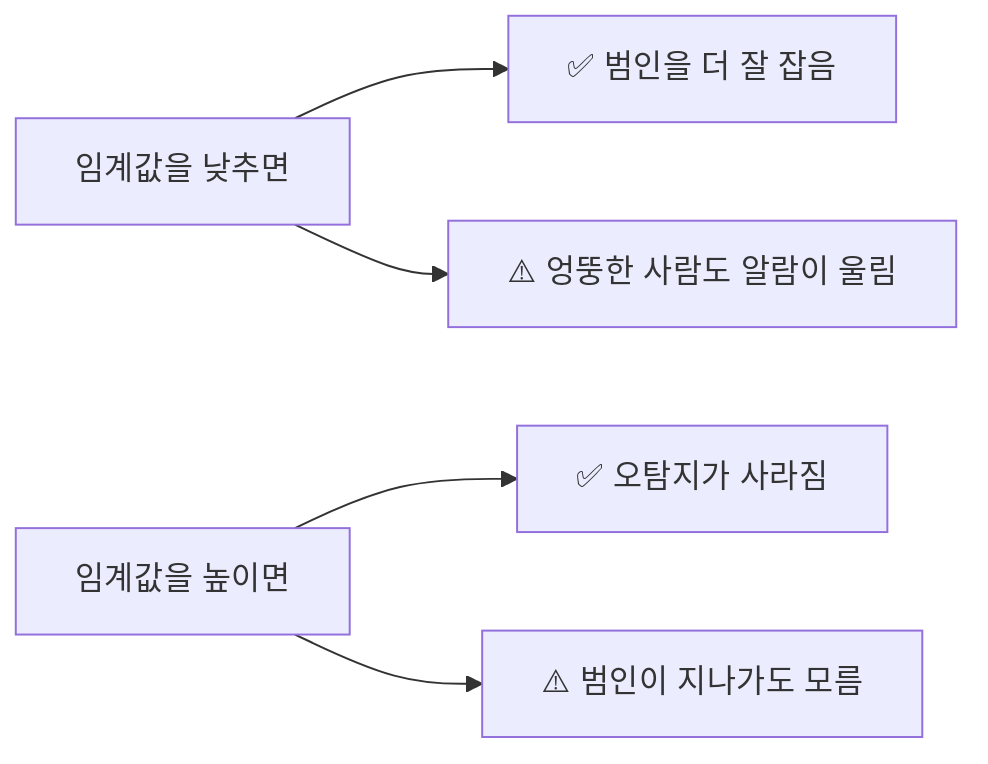

# 📘 FaceWatch 기술 종합 보고서: 파라미터 튜닝 및 로드맵

**작성일**: 2025-11-30  
**버전**: v1.0 (Optimization v4.0 반영)

---

## 1. 프로젝트 개요

**FaceWatch**는 CCTV 영상을 분석하여 범죄자나 실종자를 실시간으로 탐지하고 추적하는 시스템입니다. 단순한 얼굴 인식을 넘어, **Dynamic Bank(자가 학습)** 기술을 통해 옆모습, 마스크 착용, 저화질 영상 등 악조건에서도 대상을 놓치지 않도록 설계되었습니다.

---

## 2. 핵심 작동 원리 (The Brain)

이 시스템은 한 사람을 알아보기 위해 **3가지 기억 저장소(Bank)**를 동시에 사용합니다.

```mermaid
graph TD
    Input[CCTV 영상 입력] --> Face[얼굴 감지]
    Face --> Voting{가중치 투표}
    
    subgraph "3-Bank System"
        B1[🏛️ Base Bank] -->|가중치 100%| Voting
        B2[🔄 Dynamic Bank] -->|가중치 90%| Voting
        B3[😷 Masked Bank] -->|가중치 70%| Voting
    end
    
    B1 -.->|설명| ID카드/등록 사진 (가장 정확)
    B2 -.->|설명| 현장에서 수집한 옆모습/다양한 각도
    B3 -.->|설명| 마스크/모자 쓴 모습 데이터
    
    Voting --> Result[최종 판정]
```

---

## 3. 주요 파라미터 설명 (The Knobs)

일반 사용자도 이해하기 쉽게 비유를 사용하여 설명합니다.

### 🎯 인식 판단 (Detection)

| 파라미터 | 코드명 | 비유 | 설명 |
|:---:|:---:|:---:|:---|
| **인식 문턱값** | `main_threshold` | **높이뛰기 바(Bar)** | 이 점수를 넘어야 "동일인"으로 인정합니다. 낮을수록 잘 잡지만, 엉뚱한 사람을 잡을 위험이 커집니다. |
| **격차 점수** | `gap_margin` | **1등과 2등의 차이** | 1등 후보가 2등보다 얼마나 더 확실한가? 이 값이 커야 "닮은 사람"을 헷갈리지 않습니다. |
| **마스크 가중치** | `W_MASKED` | **신뢰도 점수** | 마스크 쓴 데이터베이스를 얼마나 믿을 것인가? (현재 70% 신뢰) |

### 🧠 자가 학습 (Dynamic Learning)

| 파라미터 | 코드명 | 비유 | 설명 |
|:---:|:---:|:---:|:---|
| **학습 문턱값** | `LEARNING_THRESHOLD` | **교과서 채택 기준** | CCTV에서 찍힌 얼굴을 "공부할 자료"로 쓸지 결정합니다. 너무 낮으면 잘못된 얼굴을 학습해버립니다. |
| **원본 확인** | `MIN_BASE_SIMILARITY` | **신분증 대조** | 새로 배운 얼굴이 원본 사진(신분증)과 최소한은 닮았는지 확인하는 안전장치입니다. |
| **각도 수집 제한** | `angle_limit` | **노트 필기량** | 각도별로 몇 장까지 기억할지 결정합니다. (현재 50장으로 대폭 확대) |

### ⚖️ 안정화 (Stability)

| 파라미터 | 코드명 | 비유 | 설명 |
|:---:|:---:|:---:|:---|
| **시간 필터** | `Temporal Filter` | **깜빡임 방지** | 찰나의 순간에 인식이 끊겨도 "잠깐 가려진 거야"라고 판단하고 추적을 유지합니다. |

---

## 4. 트레이드 오프 (Trade-offs) 관계

모든 설정에는 **등가교환**이 존재합니다. 하나를 얻으면 하나를 잃을 수 있습니다.

### 📊 1. 인식률 vs 오탐지율 (Sensitivity vs Specificity)
> "범인을 놓치지 않는 것" vs "무고한 시민을 잡지 않는 것"


* **현재 설정**: 임계값을 **34~38%**로 낮추고, 대신 **Gap Margin(격차)**을 두어 오탐지를 방어하는 전략을 사용 중입니다.

### 📊 2. 학습 속도 vs 데이터 순도 (Plasticity vs Stability)
> "빨리 배우는 것" vs "정확하게 배우는 것"

* **Dynamic Bank를 공격적으로 설정하면**: 옆모습을 금방 배우지만, 다른 사람 얼굴이 섞여 들어갈(오염) 위험이 있습니다.
* **현재 설정**: 오염 방지 장치(Base 유사도 체크)를 유지하되, 수집 기준은 대폭 완화했습니다.

---

## 5. 트러블 슈팅 가이드 (Troubleshooting)

프로젝트 진행 중 발생했던 실제 문제와 해결책입니다.

### Q1. 정면은 잘 잡는데 옆모습을 못 잡아요.
* **원인**: 등록된 사진(Base)은 정면인데, CCTV는 측면이라 유사도가 낮게 나옵니다.
* **해결**: 
    1. **Dynamic Bank**를 활성화하여 현장에서 옆모습을 실시간으로 학습시킵니다.
    2. `W_DYNAMIC`(가중치)를 0.9로 높여 학습된 데이터를 더 신뢰하게 합니다.

### Q2. 마스크나 모자를 쓰면 인식이 안 돼요.
* **원인**: 얼굴의 절반이 가려져 유사도가 급격히 떨어집니다.
* **해결**: 
    1. **Occlusion(가림) 체크**를 학습 단계에서 제거하여 마스크 쓴 모습도 학습하게 합니다.
    2. `MIN_BASE_SIMILARITY_REQUIRED`를 10%까지 낮추어, 마스크 때문에 원본과 달라 보여도 차단하지 않도록 합니다.

### Q3. 인식이 되었다가 안 되었다가 깜빡거려요.
* **원인**: 유사도가 임계값 경계선에서 오르락내리락하기 때문입니다.
* **해결**: **Temporal Filter**를 강화하여, 5프레임 중 1번만 인식되어도 추적을 유지하도록 설정합니다.

### Q4. 흐릿한 영상에서 인식이 안 돼요.
* **원인**: 화질이 나빠서 1등 후보와 2등 후보의 점수 차이가 크지 않습니다.
* **해결**: `gap_margin`을 6~10%로 낮추고, 2등 후보 점수가 높아도 무조건 차단하던 규칙을 제거했습니다.

---

## 6. 향후 개선 방향 (Future Roadmap)

현재의 얼굴 인식 기술을 넘어, 더 완벽한 추적 시스템을 위한 제안입니다.

### 👕 1. 전신/옷차림 인식 (Person Re-Identification)
* **개념**: 얼굴이 아예 안 보일 때(뒤돌아 있을 때), **옷 색깔, 가방, 체형**으로 동일인을 추적합니다.
* **효과**: 범인이 얼굴을 가리고 도망가더라도 끝까지 추적 가능합니다.
* **기술**: OSNet, ReID 모델 추가 통합.

### 😷 2. 마스크 전용 인식 모델
* **개념**: 현재는 일반 모델로 마스크 쓴 얼굴을 보지만, 아예 **눈과 눈썹만 보고 식별하도록 훈련된 특수 모델**을 도입합니다.
* **효과**: 마스크 착용 시 인식률이 획기적으로(95% 이상) 상승합니다.
* **기술**: InsightFace의 `glintr100` 등 마스크 특화 모델 사용.

### 🚶 3. 걸음걸이 분석 (Gait Analysis)
* **개념**: 사람마다 고유한 **걷는 박자와 자세**를 분석합니다.
* **효과**: 저화질 원거리 영상이나 야간에 얼굴 식별이 불가능할 때 유용합니다.

### 📹 4. 다중 카메라 추적 (Multi-Camera Tracking)
* **개념**: A번 카메라에서 사라진 범인이 B번 카메라에 나타났을 때, "같은 사람"임을 연결합니다.
* **효과**: 도시 전체를 아우르는 광역 추적 시스템 구축 가능.

---

## 7. 결론

FaceWatch는 단순한 매칭을 넘어, **상황에 맞춰 적응하는 지능형 시스템**으로 진화했습니다. 
현재 **v4.0 최적화**를 통해 정면, 측면, 마스크, 저화질 등 다양한 악조건을 극복했으며, 향후 옷차림 인식 등이 추가된다면 완벽한 보안 솔루션이 될 것입니다.
